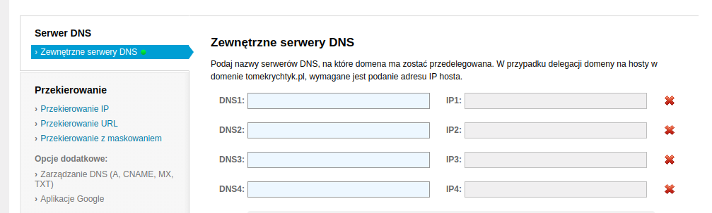
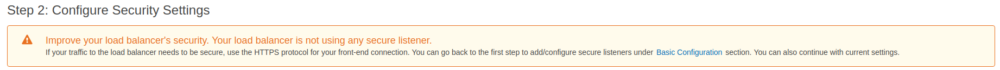
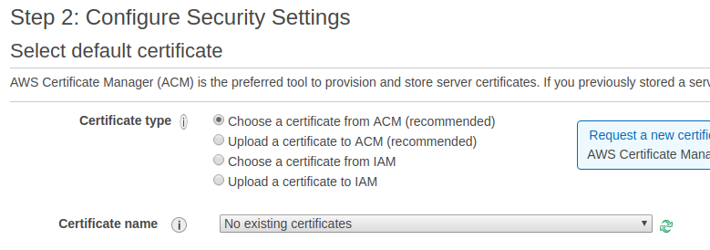

# Serwer WWW na EC2, Elastic Load Balancer i Route53

### Wprowadzenie

W tym mini-tutorialu dowiemy się, jak postawić w pełni funkcjonalny serwer WWW \(**Apache**\) przy użyciu **EC2** i **load balancera** oraz jak skonfigurować **Route53**, aby osługował domenę zarejestrowaną u zewnętrznego dostawcy \(w tym przykładzie będzie to portal [domeny.pl](https://domeny.pl)\).

### Odpalamy EC2

Pierwszym krokiem będzie oczywiście uruchomienie działającej instancji. W tym celu logujemy się do konsoli AWS i wybieramy **EC2** z grupy serwisów **Compute**. Otworzy nam się panel do zarządzania instancjami EC2. Tutaj klikamy na przycisk **Launch Instance** i wybieramy jeden z systemów operacyjnych, na jakim będzie stał serwer. Ja na potrzeby tego tutoriala wybrałem **Ubuntu Server 18.04 LTS**. Po dokonaniu wyboru systemu musimy jeszcze wybrać typ instancji. Będąc na _free tier_ mamy do wyboru tylko jeden typ jakim jest **t2.micro**. Oczywiście możemy wybrać również inny typ instancji, ale wówczas nie będzie on kwalifikował się do _free tier_, co będzie wiązać się z naliczeniem odpowiedniej opłaty w zależności od wybranego typu. Dlatego też myślę, że na potrzeby tutoriala t2.micro w zupełności wystarczy.  
Klikamy na **Next: Configure Instance Details**, zostawiamy wszystkie pola z domyślnymi wartościami i przechodzimy dalej do **Next: Add Storage**. Tutaj również pozostawiamy wartości domyślne i klikamy na **Next: Add Tags**. Możemy otagować tworzoną instancję, np. nadać jej jakąś własną nazwę. W tym celu klikamy na **Add Tags**, w polu **Key** wpisujemy np. "Name", a w polu **Value** "Webserver" \(lub jakąkolwiek inną nazwę\). Następnym krokiem jest **Next: Configure Security Groups**. Tutaj możemy zdefiniować dostęp do naszej instancji. W polu **Security group name** możemy podać nazwę nasej grupy np. "Webserver". Domyślnie otwarty będzie port 22 do dostępu po SSH. Jako że chcemy postawić w pełni sprwny serwer WWW, musimy także otworzyć porty **80** i **443**, aby umożliwić dostęp odpowiednio po HTTP i HTTPS. W tym celu klikamy na **Add Rule** i z listy wybieramy HTTP, a następnie czynność tę powtarzamy dla protokołu HTTPS.  
Teraz możemy kliknąć w **Review and launch**, a następnie **Launch**. Pojawi nam się okienko, w którym będziemy musieli utworzyć, lub wybrać aktualną parę kluczy, która będzie użyta do łączenia się z instancją przez SSH. Wybieramy z listy **Create a new key pair**, wpisujemy jej nazwę, np. "Webserver Keypair" i klikamy na przycisk **Download Key Pair**. Zapisujemy plik w wybranej przez nas lokalizacji, jednak należy oczywiście pamiętać gdzie go zapisujemy, bo inaczej nie połączymy się z instancją. Teraz wreszcie możemy kliknąć **Launch Instances** i proces tworzenia instancji zostanie rozpoczęty. Zwykle trwa on kilka minut.


Jeśli przy próbie utworzenia nowej instancji EC2 pokazuje się błąd "Launch failed" i opis błędu mówi coś o weryfikacji konta/requestu - nie przejmuj się, tak czasem się może zdarzyć przy nowych kontach. Z reguły po kilku - kilkunastu minutach powinieneś otrzymać maila od Amazonu, że wszystko jest w porządku i twoje konto jest w pełni zweryfikowane.  
Jednakże jeśli w ciągu 4 godzin nie dostaniesz maila, warto napisać do supportu i zapytać, jaki jest status Twojego konta.


#### Łączymy się przez SSH

Aby zainstalować serwer **Apache**, musimy najpierw połączyć się z naszą nowo utworzoną instancją. W tym celu otwórz linię poleceń, przejdź do katalogu, w którym zapisany jest plik klucza, który przed momentem ściągnąłeś i wykonaj polecenie `chmod 400 [nazwaKlucza].pem`.  
W konsoli AWS przejdź do EC2, z menu po lewej wybierz **Instances**. Pojawi się nam nasza instancja. Jeśli nie jest zaznaczona, zaznacz checkbox \(pierwsza ikonka po lewej stronie\). Na dole ekranu pojawią się pewne informacje dotyczące naszej instancji. Nas w tym momencie interesuje tak naprawdę tylko pole **Public DNS \(IPv4\)**. Skopiuj jego zawartość i otwórz ponownie okno terminala. Teraz wykonaj następującą komendę:

`ssh -i "[nazwaKlucza].pem" ubuntu@[tutaj-wklej-adres-ip-ktory wlasnie-skopiowales]`

W tym momencie powinniśmy uzyskać połączenie z instancją.


Jeżeli wyświetla Ci się błąd, który mówi coś o "**Too many authentication failures**", przejdź do katalogu, w którym znajduje się klucz i wykonaj poniższą komendę:  
  
`ssh-add [nazwaKlucza].pem`


#### Instalacja Apache

Kiedy już uda nam się połączyć z naszą instancją, jesteśmy gotowi na instalację serwera. W tym celu najpierw wykonujemy komendę `sudo -s` aby uzyskać prawa administratora, następnie `apt-get update` i finalnie `apt-get install apache2`.  
Po zakończeniu procesu instalacji odpalamy przeglądarkę i jako URL podajemy ponownie adres, który wcześniej skopiowaliśmy w konsoli EC2, z pola **Public DNS \(IPv4\)**. Powinniśmy w ten sposób ujrzeć domyślną stronę wygenerowaną przez Apache o tytule **Apache2 Ubuntu Default Page** \(lub coś w tym rodzaju\).

### Route53

Czas na podpięcie naszej domeny pod skrzydła AWS. Aby skierować domenę zakupioną u zewnętrznego dostawcy \(w tym przykładzie, jak już wspomniałem na początku, będzie [domeny.pl](http://domeny.pl)\) musimy mieć rzecz jasna dostęp do panelu kontrolnego domeny.

Ale po kolei. Po pierwsze logujemy się do konsoli AWS i przechodzimy do serwisu o nazwie **Route53**. Jeżeli do tej pory nie odwiedzaliśmy jeszcze tego miejsca powinna pojawić nam się strona startowa, z której wybieramy **DNS Management** poprzed kliknięcie odpowiedniego przycisku **Get Started Now**. Tutaj dostaniemy pobieżnie kilka najważniejszych informacji czym w zasadzie jest Route53 \(aczkolwiek warto się z nimi zapoznać, potrwa to góra pół minuty\). Klikamy przycisk **Create Hosted Zone**. Jest to w pewnym sensie kontener, w którym będą przechowywane przeróżne rekordy DNS i inne ważne informacje dotyczące konkretnej domeny.


**Route53 nie jest objęty warstwą** _**free tier**_, dlatego musimy być gotowi na naliczenie drobnej opłaty. Generalnie przedstawia się to tak:

* $0.50 za każdą strefę za miesiąc za pierwsze 25 stref
* $0.10 za każdą kolejną za miesiąc


Jako że do wykonania tego tutoriala potrzebujemy stworzyć jedną strefę, do naszego miesięcznego rachunku doliczone zostanie pół dolara - więc myślę, że tragedii jako tako nie ma.

Po kliknięciu na **Create Hosted Zone** musimy podać nazwę domeny, dla której tworzona jest dana strefa, czyli w moim przypadku będzie to np. _tomekrychtyk.pl_. Klikamy przycisk **Create**, czekamy kilka sekund i voila! Domyślnie Amazon utworzy dla nas da rekordy - **NS** i **SOA**. Nas interesuje w tym momencie przede wszystkim ten pierwszy - są to adresy serwerów DNS, na które przekierujemy naszą domenę w panelu kontrolnym dostawcy, u którego domenę rejestrowaliśmy. Powinniśmy zobaczyć cztery różne adresy. Kopiujemy je do notatnika, czy żeby mięc je pod ręką. Teraz musimy się teraz zalogować do panelu kontronego naszej domeny. W tym momencie ciężko mi powiedzieć dokładnie gdzie i jak się tam zalogować, bo trudno żeby każdy miał domenę u tego samego dostawcy. Generalnie chodzi o to, żeby po zalogowaniu się znaleźć ustawienia, bądź pewnie u niektórych będzie to nazwane "**Zaawansowane ustawienia DNS**" itp. W przypadku domeny.pl będąc na stronie głównej panelu klikam sobie na przycisk **Domeny**, a następnie przy konkretnej domenie mam przycisk **Zarządzaj**. I tutaj mam taką zakładę jak **Zewnętrzne serwery DNS**. To jest całe clue tego przedsięwzięcia - żeby znaleźć miejsce, gdzie możemy zdefiniować własne adresy serwerów. U mnie wygląda to mniej więcej tak:

W te cztery pola przeklejam sobie odpowiednio każdy z czterech wygenerowanych przez Route53 adresów \(czasami może zdarzyć się, że nasz dostawca udostępni tylko dwa pola do podania DNS-ów - wówczas wybieramy pierwszy dwa, które pokazują się z rekordzie NS w Route53\).  
Zapisujemy zmiany i to w zasadzie wszystko - pomyślnie przekierowaliśmy naszą domenę do Route53. Jest tylko jeden haczyk. Generalnie w zależności od dostawcy, jak też i bliżej nieokreślonych wyroków boskich, czas propagacji zmian DNS może potrwać do 24 godzin. Znaczy to mniej więcej tyle, że pomimo, że zapisaliśmy właśnie zmiany, przez kilka kolejnych godzin po wpisaniu adresu naszej domeny będzie on prowadził do serwerów dostawcy. W tym momencie nie pozostaje niestety nic innego jak tylko czekać.

### Elastic Load Balancer

Może na początku wyjaśnię krótko czym jest **load balancer**. Jak sama nazwa wskazuje load balancer w pewnym sensie balansować obłożenie i dystrybuować je na różne serwery, instancje EC2, lambdy itd. Powiedzmy, że mamy kilka web serwerów i chcemy rozłożyć na nich po równo obciążenie. W takim właśnie przypadku świetnie spradzi się load balancer.


Elastic Load Balancer występuje w trzech typach

* **Application Load Balancer** - działa na siódmej warswie modelu OSI, czyli warstwie aplikacji \([tutaj](https://pl.wikipedia.org/wiki/Model_OSI) znajdziesz więcej informacji na temat modelu OSI\). Jest używany do kontroli ruchu głównie na protokołach HTTP i HTTPS. Pozwalają na stworzenie zaawansowanych reguł routingu, kierując różne rodzaje requestów do różnych serwerów, lub grup serwerów.
* **Network Load Balancer** - działa na warswie czwartej OSI. Używany w systemach wymagających bardzo dużej wydajności - jest w stanie obsłużyć milion zapytań na sekundę. Jest to najdroższy, ale i najwydajniejszy load balancer.
* **Classic Load Balancer** - generalnie jego użycie nie jest już zalecane przez AWS. 


Aby utworzyć nowy load balancer, logujemy się do konsoli, następnie przechodzimy do EC2 i z menu po lewej stronie wybieramy **Load Balancers** z podgrupy **LOAD BALANCING**. Klikamy przycisk Create Load Balancer, a następnie wybieramy Application Load Balancer. W polu **Name** należy podać jakąś nazwę balancera, np. "WebserverALB".  
W sekcji **Listeners** wybieramy na jakich portach nasz load balancer ma nasłuchiwać i reagować na nadchodzące requesty. Domyślnie będzie tam port 80 dla protokołu HTTP. Możemy dodać tutaj również HTTPS - w tym celu klikamy na **Add Listener** i wybieramy odpowiedni protokół z listy.  
Następnie zaznaczamy wszystkie **Availability Zones** i klikamy na **Next: Configure Security Settings**.  
Jeżeli nie dodałeś listenera do SSL, zobaczysz prawdopodobnie tegu typu ostrzeżenie:

Jeśli natomiast chcemy zabezpieczyć load balancer poprzez SSL, musimy w następnym kroku podać, jaki certyfikat chcemy domyślnie używać. Tutaj opcji mamy kilka, z czego ja opiszę jedną z nich - zalecaną w przypadku kiedy nie posiadamy własnego cerytfikatu \(jeśli już takowy posiadasz możesz go po prostu przesłać do **Amazon Cerificate Manager'a** - druga opcja na screenie poniżej\).

ACM to serwis ułatwiający zarządzanie certyfikatami SSL. Pozwala na uploadowanie już posiadanych przez nas certyfikatów, ale również całkiem za darmo możemy poprosić o jego wydanie. W tym celu klikamy na **Request a new certificate from ACM**. W nowej zakładce otworzy nam się formularz, w którym należy wpisać nazwę domeny, lub kilku domen, które chcemy objąć ochroną. Albo może to być po prostu _\*.nazwatwojejdomeny.pl_. Następnie klikamy Next, wybieramy **DNS Verification** \(zakładam, że masz dostęp do panelu kontrolnego dla Twojej domeny\) i klikamy **Review** oraz ostatecznie na **Confirm and Request**.

